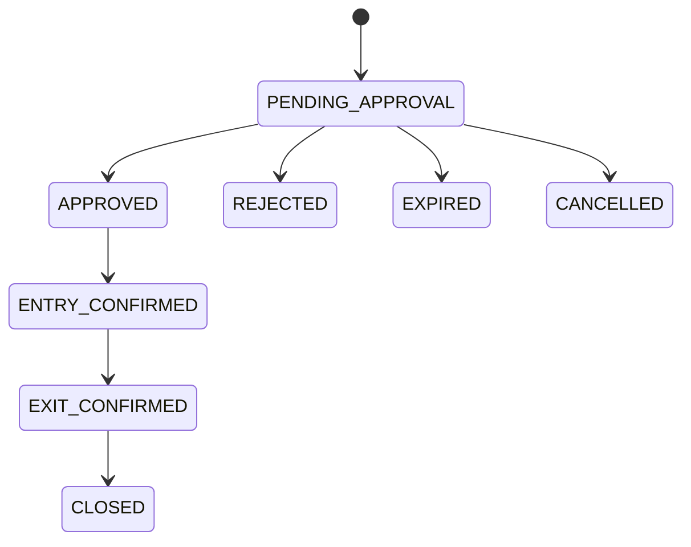

# Visitor Management Phase 1

## Scope

Phase 1 delivers:
- Proper `Gate` and `GuardAssignment` backend models.
- Visitor request lifecycle from guard creation through resident decision and entry/exit confirmation.
- Society-scoped settings using the existing module registry config store.
- Database notifications plus a configuration-driven Firebase Cloud Messaging adapter.
- Authenticated SSE for live updates, with frontend polling fallback.
- In-process expiry worker behind environment flags.
- Shared React route for guard, resident, and admin Visitor workflows.

## Architecture

Backend modules:
- `gate`: operational gate identity plus legacy device-to-gate mapping support.
- `guardAssignment`: active gate scope resolution for guard users.
- `visitor`: context, settings, realtime, queries, actions, expiry.
- `notification`: DB delivery records, device tokens, push-provider abstraction.

Frontend modules:
- `VisitorPage`: permission-driven entry route.
- `GuardVisitorView`: tower filter, flat grid, request creation modal.
- `ResidentVisitorView`: pending approvals and decision flow.
- `AdminVisitorView`: live summary, recent requests, module settings.

Key rules:
- Society scope is resolved from authenticated context for normal users.
- Super-admin style flows may pass a selected `societyId`, but scope is still revalidated server-side.
- UI color is derived from request status, not stored as business data.

## Data Flow

1. Guard opens `/visitor` and loads `/api/visitor/context`.
2. Guard selects tower and flat from `/api/visitor/towers` and `/api/visitor/towers/:towerId/flats` (paginated; the UI exposes Prev/Next controls for towers with more than 24 flats).
3. Guard uploads visitor photo through `/api/files/upload`.
4. Guard submits `/api/visitor/requests`.
5. Backend stores the request, creates DB notifications, and attempts FCM dispatch when configured.
6. Resident opens `/visitor`, sees pending requests from `/api/visitor/requests`, and approves or rejects.
7. Backend applies an atomic conditional transition, emits SSE, and updates notifications.
8. Guard receives SSE or polling refresh; **Awaiting Entry** and **Currently Inside** panels on the guard dashboard call `POST /requests/:id/confirm-entry` and `POST /requests/:id/confirm-exit`.
9. Expiry worker marks stale pending requests as `EXPIRED` and emits the same update path.

Visitor photos are served through the authenticated `GET /api/visitor/requests/:requestId/photo` endpoint (reuses the same tenant/flat/gate scoping as `GET /api/visitor/requests/:requestId`), not a public `/uploads/...` URL — the frontend fetches it as a blob and renders an object URL. FCM push notification *bodies* never include the visitor's name (only the DB notification record, which is behind auth, does); the push body says e.g. "New visitor request at {gate}".

## Status Model

Statuses:
- `DRAFT`
- `PENDING_APPROVAL`
- `APPROVED`
- `REJECTED`
- `EXPIRED`
- `CANCELLED`
- `ENTRY_CONFIRMED`
- `EXIT_CONFIRMED`
- `CLOSED`

Mermaid state diagram:



## API Surface

Gate and assignment:
- `GET /api/gates/society/:societyId`
- `POST /api/gates`
- `PATCH /api/gates/:id`
- `POST /api/gates/:gateId/link-devices`
- `GET /api/gates/legacy-device-mappings`
- `GET /api/guard-assignments/me`
- `GET /api/guard-assignments/society/:societyId`
- `POST /api/guard-assignments`
- `PATCH /api/guard-assignments/:id`

Visitor:
- `GET /api/visitor/context`
- `GET /api/visitor/events`
- `GET /api/visitor/towers`
- `GET /api/visitor/towers/:towerId/flats`
- `GET /api/visitor/settings`
- `PATCH /api/visitor/settings`
- `GET /api/visitor/requests` (supports `search` — matches visitor name or mobile number)
- `GET /api/visitor/requests/:requestId`
- `GET /api/visitor/requests/:requestId/photo` (authenticated; streams the file, same access scope as the request itself)
- `POST /api/visitor/requests`
- `POST /api/visitor/requests/:requestId/approve`
- `POST /api/visitor/requests/:requestId/reject`
- `POST /api/visitor/requests/:requestId/cancel`
- `POST /api/visitor/requests/:requestId/confirm-entry`
- `POST /api/visitor/requests/:requestId/confirm-exit`
- `GET /api/visitor/reports/summary`

Notification support:
- `POST /api/notifications/device-tokens`
- `POST /api/notifications/device-tokens/unregister`

All mutating visitor routes (`approve`/`reject`/`cancel`/`confirm-entry`/`confirm-exit`) and the view routes (`list`/`get`/`photo`) require the matching permission from the matrix below at the route level, on top of the existing flat/gate ownership check in the service layer — the ownership check alone previously wasn't backed by an explicit permission requirement. `POST /requests` is additionally rate-limited per guard (20/minute) via `visitorCreateRateLimiter`, and creation is capped per mobile number per hour via the `maxRequestsPerMobilePerHour` setting (default 10).

## Permission Matrix

| Permission | Guard | Resident | Society Admin | Facility Manager | Committee Member |
|---|---|---|---|---|---|
| `gate.read` | Yes | No | Yes | Yes | Yes |
| `gate.create/update/disable` | No | No | Yes | No | No |
| `guardAssignment.read` | Yes | No | Yes | Yes | Yes |
| `guardAssignment.manage` | No | No | Yes | No | No |
| `visitor.request.create` | Yes | No | No | No | No |
| `visitor.request.view_assigned_gate` | Yes | No | No | No | No |
| `visitor.request.view_own_flat` | No | Yes | No | No | No |
| `visitor.request.respond_own_flat` | No | Yes | No | No | No |
| `visitor.request.view_society` | No | No | Yes | Yes | Yes |
| `visitor.entry.confirm` | Yes | No | No | No | No |
| `visitor.exit.confirm` | Yes | No | No | No | No |
| `visitor.request.cancel` | Yes | No | No | No | No |
| `visitor.request.override` | No | No | Yes | No | No |
| `visitor.report.view` | No | No | Yes | Yes | Yes |
| `visitor.settings.manage` | No | No | Yes | No | No |
| `visitor.audit.view` | No | No | Yes | No | No |

## Notification Events

Logical events emitted by the Visitor module:
- `VISITOR_APPROVAL_REQUESTED`
- `VISITOR_REQUEST_APPROVED`
- `VISITOR_REQUEST_REJECTED`
- `VISITOR_REQUEST_EXPIRED`
- `VISITOR_ENTRY_CONFIRMED`
- `VISITOR_EXIT_CONFIRMED`

Current implementation details:
- DB notifications are always created.
- Push delivery uses FCM only when `FCM_ENABLED=true` and Firebase Admin credentials are present (as of this writing, `FCM_PROJECT_ID` is set but `FCM_CLIENT_EMAIL`/`FCM_PRIVATE_KEY` — a Firebase service-account key — are not, so push sending stays disabled; device-token registration and DB notifications work regardless).
- Disabled or misconfigured provider states appear as `PENDING_PROVIDER_CONFIGURATION`.
- Token-less recipients are marked `SKIPPED`.
- The push notification *body* never contains visitor PII (name); only the title, which is already generic, and a minimal `data` payload are sent to FCM. The DB notification (in-app, behind auth) keeps the full description.

## Audit Events

Actions logged to the shared `AuditLog` collection (`moduleCode: 'VISITOR'`), each recording actor, role, entity, and relevant old/new status:
- `VISITOR_REQUEST_CREATED` (includes whether a photo was attached)
- `VISITOR_REQUEST_VIEWED` (single-record fetch only, not list, to bound volume)
- `VISITOR_NOTIFICATION_REQUESTED` / `VISITOR_NOTIFICATION_FAILED`
- `VISITOR_REQUEST_APPROVED` / `VISITOR_REQUEST_REJECTED` / `VISITOR_REQUEST_CANCELLED` / `VISITOR_REQUEST_EXPIRED` / `VISITOR_ENTRY_CONFIRMED` / `VISITOR_EXIT_CONFIRMED` — each records `gateId`, the prior status, and `overrideUsed` (true when the actor bypassed normal flat/gate ownership via society-wide or override scope)
- `VISITOR_SETTINGS_CHANGED` (old and new settings)

`visitor.audit.view` gates a "View Audit Log" link on the Admin dashboard, which opens the platform's existing `/audit` page pre-filtered to `moduleCode=VISITOR` — there's no separate visitor-specific audit endpoint.

## Realtime Events

SSE transport:
- Endpoint: `GET /api/visitor/events`
- Auth: Bearer token over `fetch` stream
- Guard scope: assigned gate IDs
- Resident scope: own flat ID
- Admin scope: full society
- Heartbeat interval: `VISITOR_SSE_HEARTBEAT_MS`

Known limitation:
- The current connection registry is in-memory and suited to a single backend instance.
- For horizontal scale, swap the publisher implementation behind Redis pub/sub or a similar distributed transport.

## Database Indexes

New indexes introduced:
- `Gate`: `societyId + code`, `societyId + isActive + name`
- `GuardAssignment`: `societyId + userId + isActive`, `societyId + gateIds + isActive`
- `VisitorRequest`:
  - `societyId + createdAt`
  - `societyId + gateId + status`
  - `societyId + flatId + createdAt`
  - `societyId + expiresAt + status`
  - `societyId + visitorMobileNormalized`
  - `societyId + status + updatedAt`
  - `societyId + createdByUserId + clientRequestId` partial unique
- `NotificationDeviceToken`: `token` unique, `userId + isActive`, `societyId + isActive`

## Health and Operations

`GET /health` now reports:
- `fcmStatus`
- `queueStatus`
- `visitorRealtimeConnections`
- `visitorExpiryWorker`

Expiry worker controls:
- `VISITOR_EXPIRY_WORKER_ENABLED`
- `VISITOR_EXPIRY_WORKER_INTERVAL_MS`
- `VISITOR_EXPIRY_BATCH_SIZE`

## Configurable Settings

Society-level, via `GET`/`PATCH /api/visitor/settings` (see `visitor.constants.ts`'s `visitorSettingsSchema` for the source of truth): `defaultApprovalExpiryMinutes`, `requireVisitorPhoto`, `requireVisitorMobile`, `requirePurpose`, `allowGuardCancellation`, `requireRejectionReason`, `entryConfirmationRequired`, `exitConfirmationEnabled`, `visitorDataRetentionDays` (stored, no purge job consumes it yet), `allowedGateIds`, `realtimePollingFallbackIntervalMs`, `phase2VideoCallEnabled`, `guardStatusDisplaySeconds`, `duplicateWindowSeconds`, `maxPendingRequestsPerFlat`, `maxRequestsPerMobilePerHour`.

## Known Limitations / Follow-ups

- **Multi-role/context switching**: the platform's JWT carries one `societyId`/`flatId` per session (`gateIds` is already an array — multi-gate guards work today). `availableContexts` in the context payload is always a single-item array as a result; true switching between multiple flats/societies for one user would need a core auth change beyond this module, not a visitor-specific fix.
- **Admin analytics**: today's count, average approval time, and gate-wise activity are implemented; guard-wise activity and CSV export are not — the latter needs the platform's existing report-export convention checked before building a one-off.
- **Photo validation**: MIME type is trusted from the client-supplied header (no magic-byte/signature check); no server-side compression or metadata stripping.
- **FCM service account**: not yet configured in this environment (see Notification Events above) — sending is disabled until a Firebase service-account key is added.

## Test Commands

Backend:

```bash
cd backend
pnpm test
pnpm run build
```

Frontend:

```bash
cd frontend
pnpm run build
pnpm test
```

Coverage as of this writing: 13 backend tests (`visitor-lifecycle.test.ts`, `visitor-security.test.ts`, `gate-assignment.test.ts`) covering the happy path, idempotent duplicates, rejection, invalid-transition rejection, concurrent-approval races, cross-flat and cross-society access denial, per-mobile-number rate capping, expiry, and audit-entry creation; 6 frontend tests (`visitorApi.test.ts`, `VisitorPage.test.tsx`) covering the status-tone/query helpers and permission-based view routing (including the permission-denied state).

## Developer Onboarding

1. Seed roles and modules in the backend.
2. Enable the `VISITOR` module for the target society.
3. Create at least one `Gate`.
4. Create `GuardAssignment` records for guard users.
5. Register resident users with `flatId` and `visitor.request.respond_own_flat`.
6. Register device tokens for live push once FCM is configured.
7. Enable the expiry worker only in environments where background processing is desired.

## Phase 2 Extension Points

Reserved extension seams:
- `phase2VideoCallEnabled` setting flag
- Gate identity decoupled from device identity
- Visitor request notifications already carry stable request IDs
- SSE publisher abstraction can be replaced without rewriting request services
- Expiry processing is already isolated behind a callable service

Phase 2 should add:
- One-way visitor video
- Two-way audio
- Request-linked call records
- Signaling integrated with the current backend auth and tenant model
